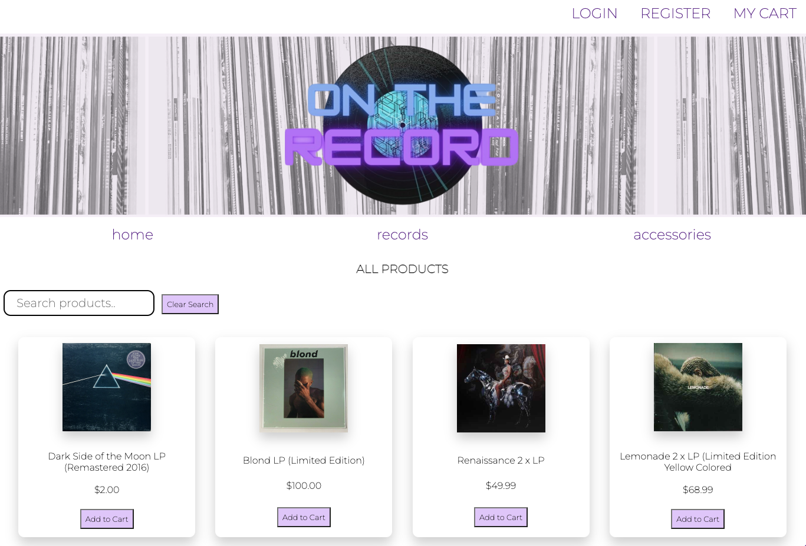

# On The Record

<!-- PROJECT LOGO -->
 

  

  <h3 align="center">On The Record</h3>

  

    An e-commerce website where people can buy new and used vinyl records and accessories, as well as leave reviews for albums and products that they love!
     

<!-- PROJECT DEMO GIF, AND IMAGES SHOULD BE PUT HERE -->

## User Demo:

https://user-images.githubusercontent.com/106750549/188232513-d80c3162-31ce-4b02-ac90-ddf3c15c1609.mp4

## Deployed Site: On The Record:

Check out On The Record here! 
<!--- You can link to the deployed site, or a link to the demo recording, or etc. here --->
https://on-the-record-capstone.herokuapp.com/

## Installing On The Record:

To install On The Record, follow these steps: Click "Use This Template"

Linux and macOS:
* If you want to run our project locally:
* Clone this repo to your local computer
* Open up VScode and cd into the directory
* Type npm install in your terminal
* Type npm run db:build to build the database
* and type npm run start:dev to run it!

## Contributing to On The Record:
<!--- If your README is long or you have some specific process or steps you want contributors to follow, consider creating a separate CONTRIBUTING.md file--->
To contribute to On The Record, follow these steps:

1. Fork this repository.
2. Create a branch: `git checkout -b <branch_name>`.
3. Make your changes and commit them: `git commit -m '<commit_message>'`
4. Push to the original branch: `git push origin <project_name>/<location>`
5. Create the pull request.

Alternatively see the GitHub documentation on [creating a pull request](https://help.github.com/en/github/collaborating-with-issues-and-pull-requests/creating-a-pull-request).

## Contributors/Collaborators:

Thanks to the following people who have contributed to this project:

Shelby Skelton: https://github.com/shelbySkelton
Olapeju Omoseni: https://github.com/obomoseni
Dusty Ferioli: https://github.com/dustinferioli

## Roadmap:

* Integrating Stripe as a Payment Method
* Emailing customers after an order is placed
* Full integration with MUI with a custom theme that matches the theme of our website
<!--- This is also a place to share any edge cases you're working on, any current limitations of the project currently and future rollouts  --->

## Contact:
<!--- You can add in your linkedin, medium, stack overflow, dev.to account, etc. here --->
shelbyskelton09@gmail.com

